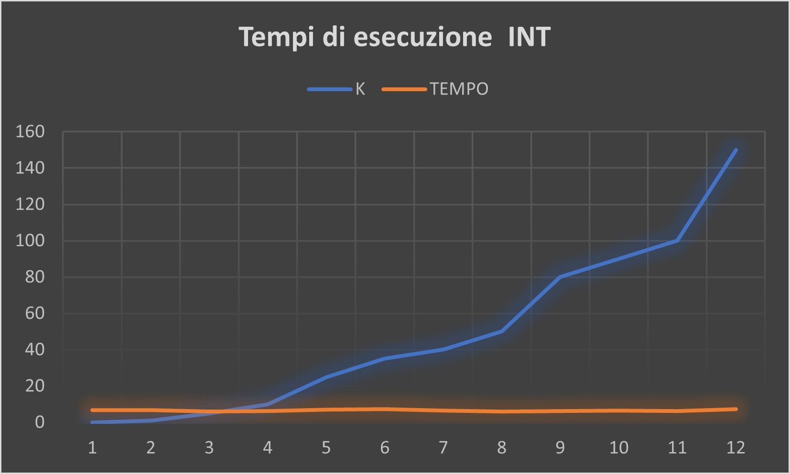
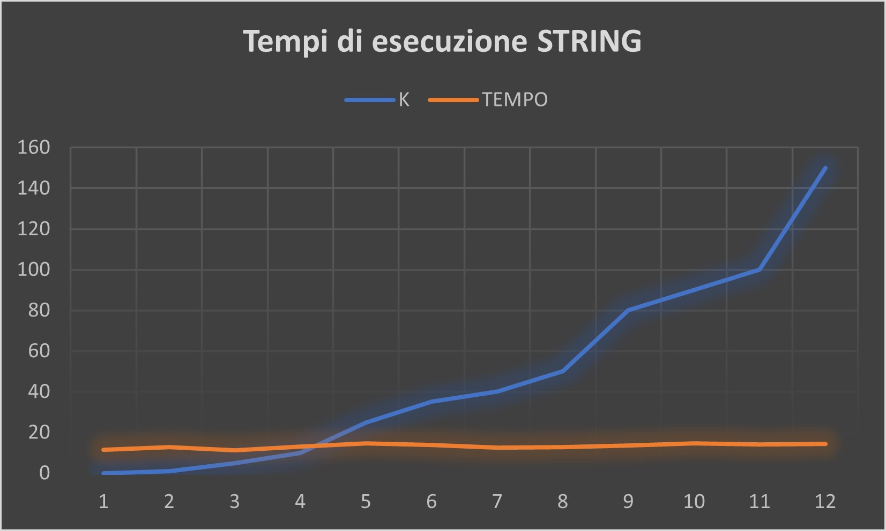
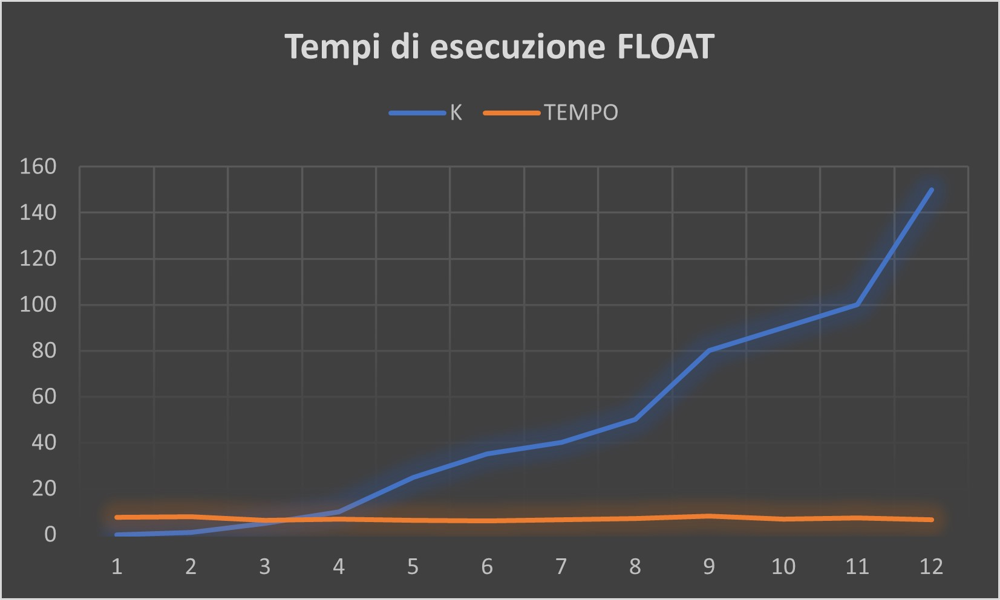

# Ex1 Merge-BinaryInsertion Sort
 Implementazione di una libreria che offre un algoritmo di ordinamento  Merge-BinaryInsertion Sort su dati generici

## CONFIGURAZIONE USATA PER LO SVILUPPO E PER I TEST:
- Sistema operativo: Ubuntu su sottosistema Windows (WSL) => L'utilizzo della WSL può influire sui tempi di esecuzione del codice.
  - Flag di compilazione gcc -Ofast => flag di compilazione -Ofast di GCC è progettato per massimizzare la velocità di esecuzione del codice generato, attivando un insieme di ottimizzazioni aggressive.

# Relazione
- Quando il parametro K assume valori significativamente più grandi di zero (K >> 0), si verifica un notevole aumento del tempo di esecuzione del programma. In particolare, la computazione richiede più di 10 minuti per terminare.

## Tempi di esecuzione  INT

| K   | TEMPO     |
| --- | --------- |
| 0   | 6.660863  |
| 1   | 6.653667  |
| 5   | 5.879599  |
| 10  | 6.306305  |
| 25  | 7.109463  |
| 35  | 7.24154   |
| 40  | 6.562018  |
| 50  | 5.943982  |
| 80  | 6.341151  |
| 90  | 6.44078   |
| 100 | 6.299445  |
| 150 | 7.199271  |

# Tempi di esecuzione STRING

| K   | TEMPO     |
|-----|-----------|
| 0   | 11.500438 |
| 1   | 12.800348 |
| 5   | 11.318940 |
| 10  | 13.114327 |
| 25  | 14.659875 |
| 35  | 13.819037 |
| 40  | 12.613566 |
| 50  | 12.751054 |
| 80  | 13.699734 |
| 90  | 14.666500 |
| 100 | 14.143493 |
| 150 | 14.370664 |

# Tempi di esecuzione FLOAT

| K   | TEMPO     |
|-----|-----------|
| 0   | 7.454076  |
| 1   | 7.711795  |
| 5   | 6.298202  |
| 10  | 6.859730  |
| 25  | 6.247170  |
| 35  | 5.967951  |
| 40  | 6.520817  |
| 50  | 7.104663  |
| 80  | 7.980238  |
| 90  | 6.711730  |
| 100 | 7.185458  |
| 150 | 6.367997  |

- I tempi sono espressi in secondi (s).