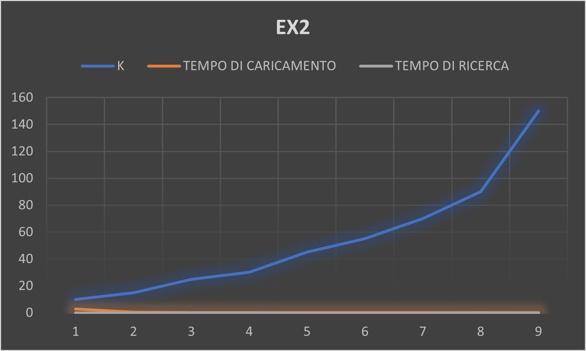

# Implementazione di Skip List

# Skip List

La Skip List è una struttura dati che memorizza una lista ordinata di elementi ed è progettata per consentire operazioni di inserimento e ricerca efficienti. È simile a una lista concatenata, ma include puntatori multipli che consentono di "saltare" rapidamente attraverso la lista durante le operazioni di ricerca.
La caratteristica principale della Skip List è l'utilizzo di livelli multipli. Ogni nodo nella Skip List contiene un valore e un array di puntatori che collegano il nodo ad altri nodi su livelli superiori. I livelli superiori sono costruiti aggiungendo nodi con una certa probabilità. Ciò permette di evitare la scansione completa della lista durante le operazioni di ricerca, riducendo il tempo di esecuzione.
Durante l'inserimento di un nuovo elemento, la Skip List utilizza una funzione di randomizzazione per determinare l'altezza del nodo. La funzione di randomizzazione assegna casualmente un livello al nuovo nodo, consentendo una distribuzione uniforme degli elementi nella struttura dati.

- La Skip List offre un'alternativa efficiente a strutture dati come gli alberi binari di ricerca.

## Configurazione di Sviluppo e Test

- Sistema operativo: Ubuntu su Windows Subsystem for Linux (WSL)
  - L'utilizzo di WSL potrebbe influire sui tempi di esecuzione del codice.

## Tabella dei Dati caricamento e ricerca

| K   | TEMPO DI CARICAMENTO | TEMPO DI RICERCA |
| --- | ------------------- | ---------------- |
| 10  | 2.875223s           | 0.000370s        |
| 15  | 0.306100s           | 0.000170s        |
| 25  | 0.273642s           | 0.000271s        |
| 30  | 0.271959s           | 0.000259s        |
| 45  | 0.260020s           | 0.000188s        |
| 55  | 0.277141s           | 0.000171s        |
| 70  | 0.266310s           | 0.000205s        |
| 90  | 0.263551s           | 0.000270s        |
| 150 | 0.277182s           | 0.000151s        |

- I tempi sono espressi in secondi (s).



## Ruolo della Funzione di Randomizzazione
- La funzione randomica, utilizzata nell'inserimento di un nuovo nodo nella Skiplist, aiuta ad ottenere tali effetti in quanto essa cerca di rendere casuale ed uniforme, la distruzione degli elementi nella struttura dati. Se l'altezza della Skiplist è fissata ad un valore basso rispetto al numero di elementi che si vuole inserire, si avrà una probabilità più alta di formare una sequenza di livelli crescente/decrescente o circa sullo stesso livello, facendo "collassare" la Skiplist in una lista tradizionale.

```c
int randomLevel(size_t max_height)
{
    int level = 0;

    while (((double)rand() / RAND_MAX) < 0.5 && level < max_height)
    {
        level = level + 1;
    }
    return level;
}
```


- La funzione randomLevel() utilizza la funzione rand() per generare un numero casuale nell'intervallo [0, RAND_MAX] e lo divide per RAND_MAX per ottenere un valore casuale compreso tra 0 e 1. Successivamente, confronta questo valore con la soglia di 0.5 per determinare se generare un nuovo puntatore di livello superiore nella Skip List.
- Il confronto tra il valore casuale e la soglia di 0.5 assicura che la probabilità di generare un nuovo puntatore di livello superiore nella Skip List sia del 50%, fornendo una struttura bilanciata ed efficiente.

## Conclusioni
L'analisi delle prestazioni della Skip List mette in evidenza l'importanza dell'altezza della struttura nella gestione dei tempi di inserimento e ricerca. Mantenere un'altezza adeguata, come un valore di 15 o superiore, può contribuire a ottenere prestazioni ottimali per entrambe le operazioni. La funzione di randomizzazione svolge un ruolo cruciale nella distribuzione casuale degli elementi e nel mantenimento dell'efficienza della Skip List.

Abbassando l'altezza della Skiplist il tempo per l'aggiunta degli elementi incrementa notevolmente. Con un valore di altezza massima fissato ad un intero maggiore o uguale 15 il grafico si stabilizza a un tempo di inserimento pari a circa 0.3 secondi. Il tempo di ricerca non è mai esageratamente alto.