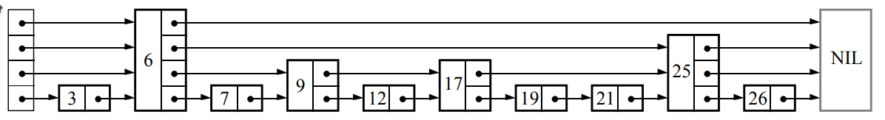

# Laboratorio per il corso di Algoritmi e Strutture Dati

- Esercizio 1: C
- Esercizio 2: C
- Esercizio 3: Java
- Esercizio 4: Java

## Esercizio 1 - Merge-BinaryInsertion Sort

### Linguaggio richiesto: C

### Testo

Implementare una libreria che offre un algoritmo di ordinamento  *Merge-BinaryInsertion Sort* su dati generici, implementando il seguente prototipo di funzione:

```
void merge_binary_insertion_sort(void *base, size_t nitems, size_t size, size_t k, int (*compar)(const void *, const void*));
```

- `base` è un puntatore al primo elemento dell'array da ordinare;
- `nitems` è il numero di elementi nell'array da ordinare;
- `size` è la dimensione in bytes di ogni elemento dell'array;
- `k` è un parametro dell'algoritmo;
- `compar` è il criterio secondo cui ordinare i dati (dati due **puntatori a elementi** dell'array, restituisce un numero maggiore, uguale o minore di zero se il primo argomento è rispettivamente maggiore, uguale o minore del secondo). 

Con *BinaryInsertion Sort* ci riferiamo a una versione dell'algoritmo *Insertion Sort* in cui la posizione, all'interno della sezione ordinata del vettore, in cui inserire l'elemento corrente è determinata tramite ricerca binaria. Il *Merge-BinaryInsertion Sort* è un algoritmo ibrido che combina *Merge Sort* e *BinaryInsertion Sort*.  L'idea è di approfittare del fatto che il *BinaryInsertion Sort* può essere più veloce del *Merge Sort* quando la sottolista da ordinare è piccola. Ciò suggerisce di considerare una modifica del *Merge Sort* in cui le sottoliste di lunghezza `k` o inferiore sono ordinate usando il  *BinaryInsertion Sort* e sono poi combinate usando il meccanismo tradizionale di fusione del *Merge Sort*. Il valore del parametro `k` dovrà essere studiato e discusso nella relazione. Ad esempio, `k=0` implica che *Merge-BinaryInsertion Sort* si comporta esattamente come il *Merge Sort* classico, mentre `k>>0` aumenta l'utilizzo del *BinaryInsertion Sort*.

In alternativa, è anche ammissibile implementare il seguente prototipo meno generico, che ordina dati a patto che siano organizzati in un array di puntatori:

```
void merge_binary_insertion_sort(void **base, size_t nitems, size_t k, int (*compar)(const void *, const void*));
```

- `base` è un puntatore al primo elemento dell'array di puntatori da ordinare sulla base dei valori riferiti;
- `nitems` è il numero di elementi nell'array di puntatori da ordinare;
- `k` è un parametro dell'algoritmo;
- `compar` è il criterio secondo cui ordinare i dati (dati due **elementi** dell'array di puntatori).

Dato che la prima versione è anche in grado di ordinare array di puntatori (passando un comparatore opportuno, i cui argomenti saranno puntatori a puntatori ai dati), non serve implementare questa seconda versione se avete già implementato la prima.

### Unit Testing

Implementare gli unit-test.

### Uso della libreria di ordinamento implementata

Il file `records.csv` che potete trovare (compresso) all'indirizzo

```
https://datacloud.di.unito.it/index.php/s/X7qC8JSLNRtLxPC
```

contiene 20 milioni di record da ordinare.
Ogni record è descritto su una riga e contiene i seguenti campi:

- `id`: (tipo intero) identificatore univoco del record;
- `field1`: (tipo stringa) contiene parole estratte dalla divina commedia,
  potete assumere che i valori non contengano spazi o virgole;
- `field2`: (tipo intero);
- `field3`: (tipo floating point).

Il formato è un CSV standard: i campi sono separati da virgole; i record sono
separati da `\n`.

Usando l'algoritmo implementato precedentemente, si realizzi la seguente funzione per ordininare *record* contenuti nel file `records.csv` in ordine non decrescente secondo i valori contenuti nei tre campi "field".

```
void sort_records(const char *infile, const char *outfile, size_t k, size_t field);
```

- `infile` è il percorso del file CSV contenente i record da ordinare;
- `outfile` è un percorso nel quale salvare i record ordinati (che deve essere diverso da `infile`);
- `k` è un parametro dell'algoritmo;
- `field` può valere 1, 2 o 3 e indica quale dei tre campi deve essere usato per ordinare i record.

Si misurino i tempi di risposta variando il valore di `k`, per ciascuno dei tre field che si possono usare come chiave di ordinamento, e si produca una breve relazione in cui si riportano i risultati ottenuti insieme a un loro commento. Dimostrare nella relazione come il valore di `k` dovrebbe essere scelto nella pratica. Nel caso l'ordinamento si protragga per più di 10 minuti potete interrompere l'esecuzione e riportare un fallimento dell'operazione. I risultati sono quelli che vi sareste aspettati? Se sì, perché? Se no, fate delle ipotesi circa il motivo per cui l'algoritmo non funziona come vi aspettate, verificatele e riportate quanto scoperto nella relazione. I risultati dipendono dal campo usato come chiave di ordinamento?

## Esercizio 2 - SkipList

### Linguaggio richiesto: C

### Testo

Realizzare una struttura dati chiamata *SkipList*. La *SkipList* è un tipo di lista concatenata che memorizza una *lista ordinata* di elementi.

Al contrario delle liste concatenate classiche, la *SkipList* è una struttura dati probabilistica che permette di realizzare l'operazione di ricerca con complessità `O(log n)` in termini di tempo. Anche le operazioni di inserimento e cancellazione di elementi possono essere realizzate in tempo `O(log n)`. Per questa ragione, la *SkipList* è una delle strutture dati che vengono spesso utilizzate per indicizzare dati.

Ogni nodo di una lista concatenata contiene un puntatore all'elemento successivo nella lista. Dobbiamo quindi scorrere la lista sequenzialmente per trovare un elemento nella lista. La *SkipList* velocizza l'operazione di ricerca creando delle "vie espresse" che permettono di saltare parte della lista durante l'operazione di ricerca. Questo è possibile perché ogni nodo della *SkipList* contiene non solo un singolo puntatore al prossimo elemento della lista, ma un array di puntatori che ci permettono di saltare a diversi punti seguenti nella lista. Un esempio di questo schema è rappresentato nella seguente figura:



Si implementi quindi una libreria che realizza la struttura dati *SkipList* implementando la seguente dichiarazione:

```
struct SkipList;
```

L'implementazione deve essere generica per quanto riguarda il tipo dei dati memorizzati nella struttura. Come suggerimento, una possibile definizione del tipo di dati *SkipList* è il seguente:

```
struct SkipList {
  struct Node *head;
  size_t max_level;
  size_t max_height;
  int (*compare)(const void*, const void*);
};

struct Node {
  struct Node **next;
  size_t size;
  void *item;
};
```

Dove:

- `head` è il primo nodo della *SkipList*;
- `max_level` è il massimo numero di puntatori che **al momento ci sono** in un singolo nodo della *SkipList* (come si vede nella figura, ogni nodo può avere un numero distinto di puntatori);
- `max_height` è una costante che definisce il massimo numero di puntatori che **possono esserci** in un singolo nodo della *SkipList*;
- `compar` è il criterio secondo cui ordinare i dati (dati due puntatori a elementi);
- `next` è l'array di puntatori in un dato nodo della *SkipList*;
- `size` è il numero di puntatori in un dato nodo della *SkipList*;
- `item` è il dato memorizzato in un dato nodo della *SkipList*.

La libreria deve implementare tutte le seguenti dichiarazioni.

```
void new_skiplist(struct SkipList **list, size_t max_height, int (*compar)(const void *, const void*));

void clear_skiplist(struct SkipList **list);

void insert_skiplist(struct SkipList *list, void *item);

const void* search_skiplist(struct SkipList *list, void *item);
```

##### newSkipList: alloca una skiplist vuota

La funzione deve allocare una nuova skiplist, data l'altezza massima e la funzione di confronto, salvando la locazione di memoria allocata in `*list`.

##### clearSkipList: dealloca una skiplist

La funzione deve liberare correttamente tutta la memoria allocata per la *SkipList*, inclusi tutti i nodi interni e i dati in essi contenuti. L'utilizzo inteso di queste prime due funzioni è ad esempio:

```
struct Skiplist* list = NULL;
new_skiplist(&list, 10, compare);
// ora list != NULL, posso usarla
// per inserire elementi: insert_skiplist(list, ptr); 
// per cercare elementi: search_skiplist(list, ptr) != NULL; 
clear_skiplist(&list);
// ora list == NULL e tutta la memoria è libera
```

##### insertSkipList: inserisce un elemento nella skiplist

La funzione deve inserire un certo elemento `item` nella skiplist `list`. L'elemento da inserire viene fornito come puntatore ad un dato generico, la cui "responsabilità" viene passata alla skiplist (che quindi dovrà deallocarlo quando verrà deallocata la skiplist). Una possibile implementazione di questa funzione in pseudo-codice (da tradurre quindi in C) è la seguente:

```
insertSkipList(list, item)

    new = createNode(item, randomLevel())
    if new->size > list->max_level
        list->max_level = new->size

    x = list->head
    for k = list->max_level downto 1 do
        if (x->next[k] == NULL || item < x->next[k]->item)
            if k < new->size {
              new->next[k] = x->next[k]
              x->next[k] = new
            }
        else
            x = x->next[k]
            k++
```

La funzione ``randomLevel()`` nel codice precedente determina il numero di puntatori da includere nel nuovo nodo e deve essere realizzata conformemente al seguente algoritmo. Spiegare il vantaggio di questo algoritmo nella relazione da consegnare con l'esercizio:

```
randomLevel()
    lvl = 1

    // random() returns a random value in [0...1)
    while random() < 0.5 and lvl < MAX_HEIGHT do
        lvl = lvl + 1
    return lvl
```

#####  searchSkipList: verifica se un elemento è presente nella skiplist

La funzione deve verificare se un elemento con valore uguale ad  `item` è presente nella skiplist `list`; restituendo `NULL` se nessuna corrispondenza viene trovata, e restituendo il puntatore all'elemento `item` memorizzato nella skiplist altrimenti. Una possibile implementazione di questa funzione in pseudo-codice (da tradurre quindi in C) è la seguente:

```
searchSkipList(list, item)
    x = list->head

    // loop invariant: x->item < item
    for i = list->max_level downto 1 do
        while x->next[i]->item < item do
            x = x->next[i]

    // x->item < item <= x->next[1]->item
    x = x->next[1]
    if x->item == item then
        return x->item
    else
        return failure
```

### Unit Testing

Implementare gli unit-test per tutte le operazioni della *SkipList*.

### Uso delle funzioni implementate

All'indirizzo

```
https://datacloud.di.unito.it/index.php/s/taii8aA8rNnXgCN
```
potete trovare un dizionario (`dictionary.txt`) e un file da correggere (`correctme.txt`).

Il dizionario contiene un elenco di parole. Le parole sono scritte di seguito, ciascuna su una riga.

Il file `correctme.txt` contiene un testo da correggere. Alcune parole in questo testo non ci sono nel dizionario.

Si implementi una applicazione che usa la struttura dati `*SkipList*` per determinare in maniera efficiente la lista di parole nel testo da correggere non presenti nel dizionario dato come input al programma. L'applicazione deve implementare la seguente dichiarazione:

```
void find_errors(const char *dictfile, const char *textfile, size_t max_height);
```

- `dictfile` è il percorso del file contenente le parole del dizionario;
- `textfile` è il percorso del file contenente il testo da correggere;
- `max_height` è il parametro della *SkipList*;
- la funzione deve stampare a schermo le parole del testo non presenti nel dizionario, nell'ordine con cui appaiono nel testo da correggere.

Si sperimenti il funzionamento dell'applicazione considerando diversi valori per il parametro ``max_height``, riportando in una breve relazione (circa una pagina) i risultati degli esperimenti.

## Esercizio 3 - PriorityQueue

### Linguaggio richiesto: Java

### Testo

Si implementi la struttura dati *coda con priorità (PriorityQueue)*.

La struttura dati deve gestire tipi generici e consentire un numero qualunque e non noto a priori di elementi, implementando la seguente interfaccia:

```
public interface AbstractQueue<E> {
  public boolean empty(); // controlla se la coda è vuota
  public boolean push(E e); // aggiunge un elemento alla coda
  public E top(); // accede all'elemento in cima alla coda
  public void pop(); // rimuove l'elemento in cima alla coda
};
```

La classe `PriorityQueue<E>` che implementa l'interfaccia dovrebbe avere almeno un costruttore che crea una coda vuota e prende come argomento un `Comparator<E>` da usare per confrontare gli elementi.

### Unit Testing

Implementare gli unit-test degli algoritmi.

## Esercizio 4 - Grafi sparsi e foreste ricoprenti minime

### Linguaggio richiesto: Java

### Testo

Si implementi una libreria che realizza la struttura dati Grafo in modo che sia ottimale per dati sparsi
(**attenzione**: le scelte implementative che farete dovranno essere giustificate in relazione alle nozioni presentate
durante le lezioni in aula).

La struttura deve consentire di rappresentare sia grafi diretti che grafi non diretti
(*suggerimento*:  un grafo non diretto può essere rappresentato usando un'implementazione per grafi diretti modificata
per garantire che, per ogni arco *(a,b)* etichettato *w*, presente nel grafo, sia presente nel grafo anche l'arco *(b,a)*
etichettato *w*. Ovviamente, il grafo dovrà mantenere l'informazione che specifica se esso è un grafo diretto o non diretto.).

L'implementazione deve essere generica sia per quanto riguarda il tipo dei nodi, sia per quanto riguarda le etichette
degli archi.
La struttura dati implementata dovrà offrire (almeno) le seguenti operazioni (accanto a ogni operazione è specificata la
complessità richiesta; n può indicare il numero di nodi o il numero di archi, a seconda del contesto):

- Creazione di un grafo vuoto – O(1)
- Aggiunta di un nodo – O(1)
- Aggiunta di un arco – O(1)
- Verifica se il grafo è diretto – O(1)
- Verifica se il grafo contiene un dato nodo – O(1)
- Verifica se il grafo contiene un dato arco – O(1)  _(*)_
- Cancellazione di un nodo – O(n)
- Cancellazione di un arco – O(1)  (*)
- Determinazione del numero di nodi – O(1)
- Determinazione del numero di archi – O(n)
- Recupero dei nodi del grafo – O(n)
- Recupero degli archi del grafo – O(n)
- Recupero nodi adiacenti di un dato nodo – O(1)  _(*)_
- Recupero etichetta associata a una coppia di nodi – O(1) _(*)_
- Determinazione del peso del grafo (se il grafo non è pesato, il metodo può terminare con un errore)– O(n)

_(*)_ quando il grafo è veramente sparso, assumendo che l'operazione venga effettuata su un nodo la cui lista di adiacenza ha una lunghezza in O(1).

### Unit Testing

Implementare gli unit-test.

### Uso della libreria che implementa la struttura dati Grafo

Si implementi l'algoritmo di Prim per la determinazione della minima foresta  ricoprente di un grafo, secondo il seguente template:

```
public class Prim {
  public static void main(String[] args) {
    // leggi i dati CSV del grafo dal percorso in args[1] 
    // calcola la minima foresta ricoprente con l'algoritmo di Prim
    // scrivi su standard output una descrizione della foresta calcolata come CSV  
  }
}
```

L'implementazione dell'algoritmo di Prim dovrà utilizzare la struttura dati *PriorityQueue* implementata nell'esercizio precedente e la struttura dati grafo appena implementata.
La struttura dati e l'algoritmo di Prim dovranno poi essere utilizzati con i dati contenuti nel file `italian_dist_graph.csv`, che potete recuperare all'indirizzo:

```
https://datacloud.di.unito.it/index.php/s/PirTJpq4JMnpH3G
```

Tale file contiene le distanze in metri tra varie località italiane e una frazione delle località a loro più vicine. Il formato è un CSV standard: i campi sono separati da virgole; i record sono separati dal carattere di fine riga (`\n`).

Ogni record contiene i seguenti dati:

- `place1`: (tipo stringa) nome della località "sorgente" (la stringa può contenere spazi ma non può contenere virgole);
- `place2`: (tipo stringa) nome della località "destinazione" (la stringa può contenere spazi ma non può contenere virgole);
- `distance`: (tipo float) distanza in metri tra le due località.

**Note:**

- Nel caso in cui il grafo sia costituito da una sola componente connessa, l'algoritmo restituirà un albero. Nel caso in cui, invece, vi siano più componenti connesse, l'algoritmo restituirà una foresta costituita dai minimi alberi ricoprenti di ciascuna componente connessa.
- Potete intrepretare le informazioni presenti nelle righe del file come   archi **non diretti** (per cui probabilmente vorrete inserire nel vostro grafo sia l'arco di andata che quello di ritorno a fronte di ogni riga letta).
- Il file è stato creato a partire da un dataset poco accurato. I dati riportati contengono inesattezze e imprecisioni.
- Un'implementazione corretta dell'algoritmo di Prim, eseguita sui dati contenuti nel file `italian_dist_graph.csv`, dovrebbe determinare una minima foresta ricoprente con 18.640 nodi, 18.637 archi (non orientati) e di peso complessivo di circa 89.939,913 Km.
